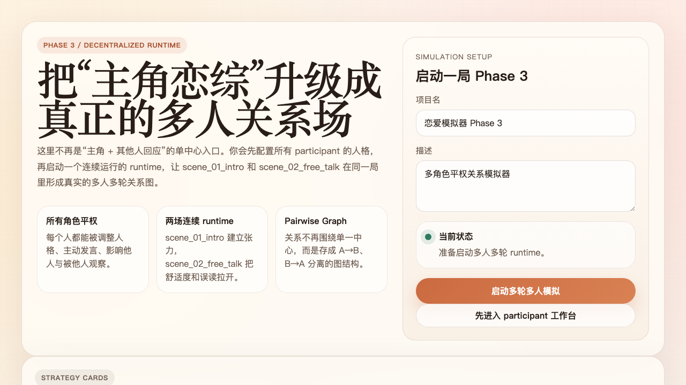
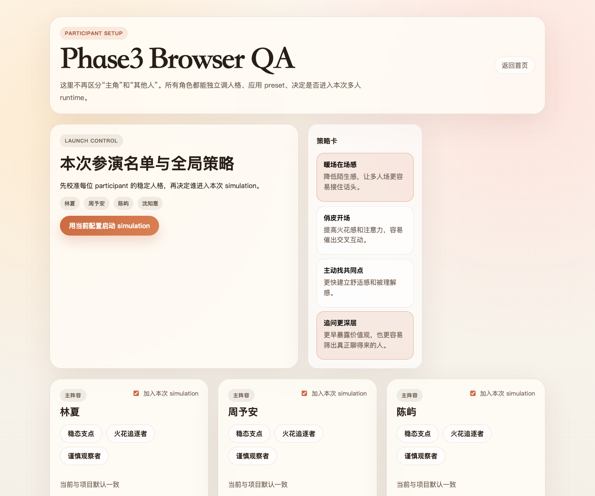
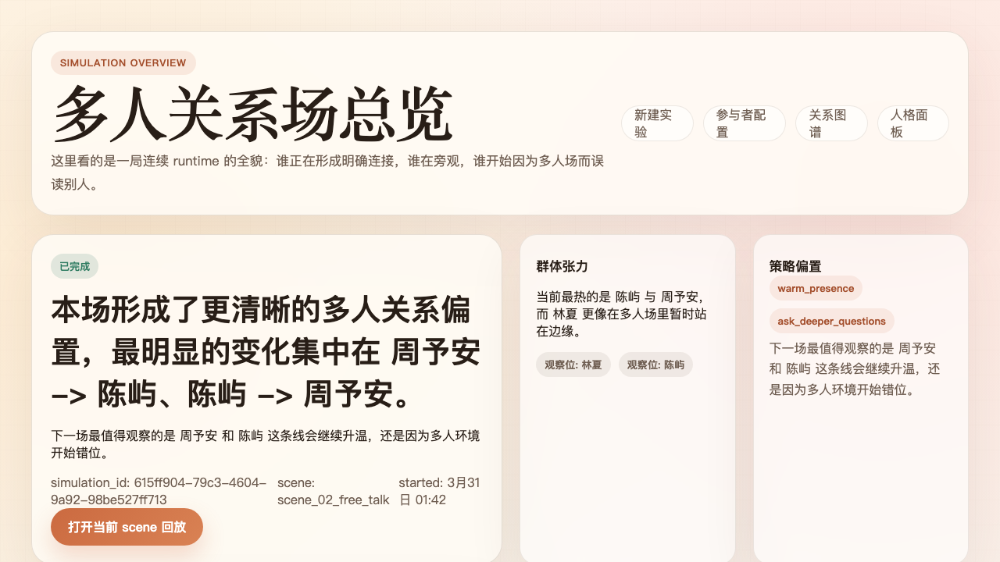
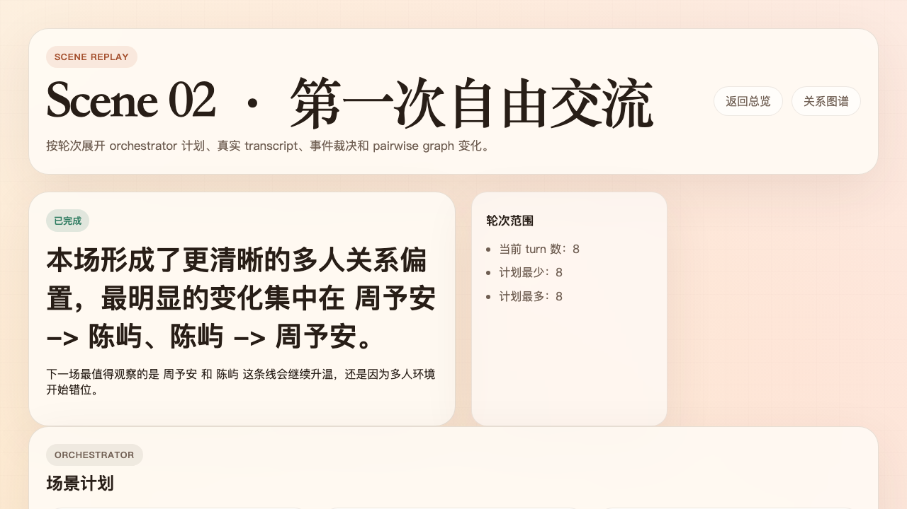
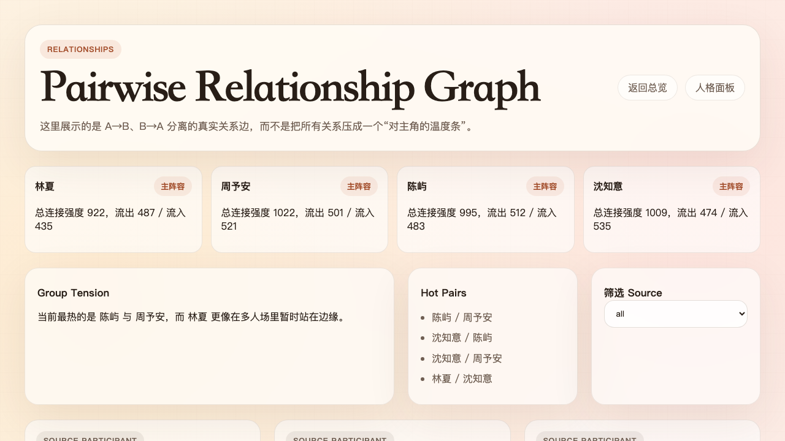
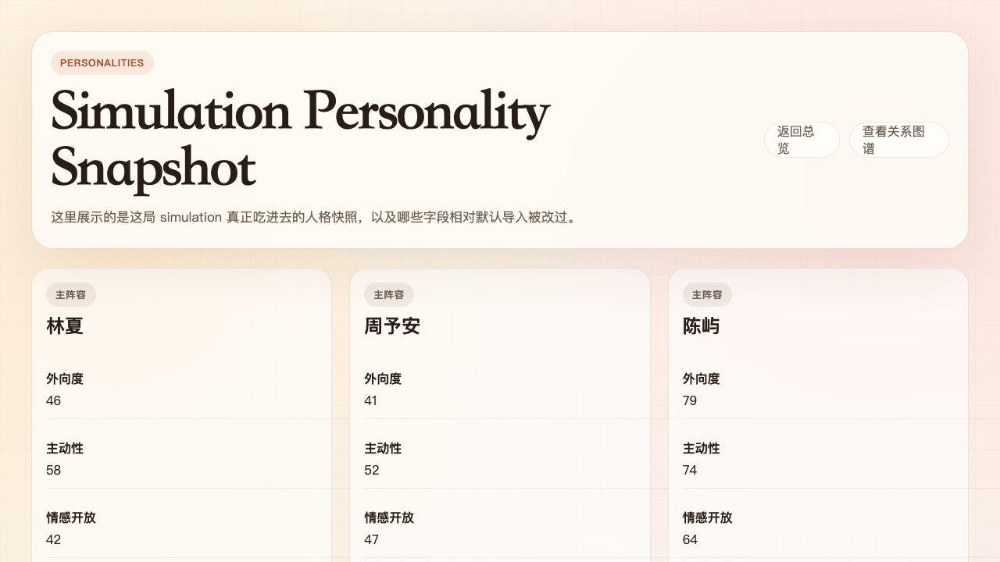
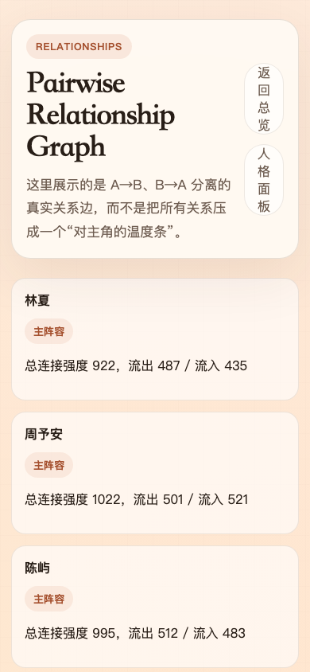
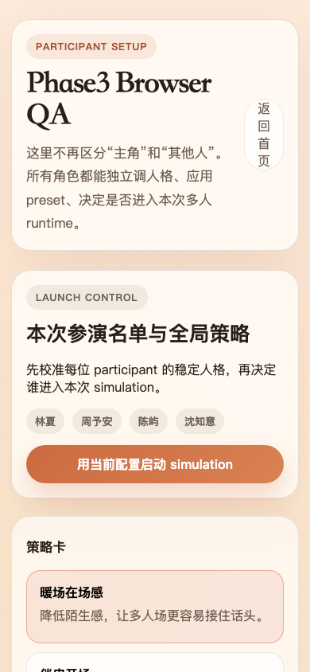

# 恋爱模拟器 Phase 3

一个基于 FastAPI + Redis Worker + Next.js 的多角色平权关系模拟器。

当前交付重点不再是“主角带动其他人回应”，而是把系统升级成真正的 Phase 3：

1. 所有角色使用统一 participant 模型
2. pairwise relationship graph 持久化 A→B / B→A 独立关系边
3. `scene_01_intro` 升级为多人多轮 runtime
4. `scene_02_free_talk` 从占位变成真实可运行场景
5. 前端提供首页、participant setup、simulation overview、scene replay、relationships、personalities 六个产品页面

## Features

- 去中心化 runtime：后端核心路径不再依赖 `protagonist_guest_id`
- 统一 participant 模型：所有角色平等导入、平等入场、平等被调人格
- DashScope 百炼兼容 live 调用，支持 `DIRECTOR_PROVIDER_MODE=auto`
- `scene_01_intro` 6 turn 多人多轮
- `scene_02_free_talk` 8 turn 可稳定运行
- pairwise relationship graph、scene memory、event links、state snapshots 落库
- participant personality presets、项目默认人格、simulation override
- overview / replay / relationships / personalities 全部适配多人关系场
- Docker Compose 一键启动

## Tech Stack

- Backend: FastAPI, SQLAlchemy, Alembic, Redis Worker, PostgreSQL
- Frontend: Next.js App Router
- LLM Provider: DashScope-compatible OpenAI API
- Infra: Docker Compose

## Repository Layout

```text
backend/                           FastAPI API, worker, runtime, models, migrations
frontend/                          Next.js 页面与前端 API 客户端
docs/screenshots/                  浏览器实测截图
PHASE1_IMPLEMENTATION.md           Phase 1 实现说明
PHASE2_PLAN.md                     Phase 2 范围、接口、验收标准
PHASE3_PLAN.md                     Phase 3 目标、改造清单、验收标准
BACKEND_ARCHITECTURE.md            后端架构说明
SCENE_DESIGN.md                    场景设计
STATE_UPDATE_RULES.md              状态更新规则
Soul.md                            角色灵魂设定
API_Test.py                        DashScope 兼容调用参考
```

## Quick Start

### 1. 配置环境变量

复制示例环境变量并填入 DashScope API Key：

```bash
cp .env.example .env
```

`.env` 示例：

```env
DASHSCOPE_API_KEY=your_key_here
DIRECTOR_PROVIDER_MODE=auto
```

说明：

- `DIRECTOR_PROVIDER_MODE=auto` 时，有 `DASHSCOPE_API_KEY` 就走 live；没有则退回 mock。
- 默认前端访问后端地址为 `http://localhost:8000/api`。

### 2. 一键启动

```bash
./run.sh
```

等价于：

```bash
docker compose -p love-simulator up --build -d
```

### 3. 打开页面

- 前端首页: `http://localhost:3000`
- 后端健康检查: `http://localhost:8000/health`
- OpenAPI: `http://localhost:8000/docs`

### 4. 停止服务

```bash
./stop.sh
```

## How To Run A Simulation

### 方式 A: 快速启动

1. 打开首页 `http://localhost:3000`
2. 使用首页默认 participant 配置，或直接修改每位角色的基础人格
3. 选择 1-2 张策略卡
4. 点击“启动多轮多人模拟”
5. 页面会跳转到 `/simulations/{id}` 总览页
6. 等待 worker 连续完成 `scene_01_intro` 与 `scene_02_free_talk`

### 方式 B: 先进入 participant 工作台

1. 在首页点击“先进入 participant 工作台”
2. 在 `/projects/{id}/participants` 调整每位角色的人格
3. 可对单个角色应用 preset，也可保存为项目默认人格
4. 勾选本次进入 simulation 的 participant
5. 点击“用当前配置启动 simulation”

## Main Pages

- 首页: `/`
- participant setup: `/projects/{id}/participants`
- simulation 总览页: `/simulations/{id}`
- scene 回放页: `/simulations/{id}/scenes/{sceneRunId}`
- relationships 页: `/simulations/{id}/relationships`
- personalities 页: `/simulations/{id}/personalities`

## API Summary

项目与 participant：

- `POST /api/projects`
- `GET /api/projects/{project_id}`
- `POST /api/projects/{project_id}/participants/import`
- `GET /api/projects/{project_id}/participants`
- `GET /api/projects/{project_id}/participants/{participant_id}/personality`
- `PATCH /api/projects/{project_id}/participants/{participant_id}/personality`
- `GET /api/projects/{project_id}/personality-presets`
- `POST /api/projects/{project_id}/personality-presets/apply`

simulation 与 runtime：

- `POST /api/projects/{project_id}/simulations`
- `GET /api/simulations/{simulation_id}`
- `GET /api/simulations/{simulation_id}/scenes/{scene_run_id}`
- `GET /api/simulations/{simulation_id}/timeline`
- `GET /api/simulations/{simulation_id}/relationships`
- `GET /api/simulations/{simulation_id}/relationship-graph`
- `GET /api/simulations/{simulation_id}/personalities`

ingestion：

- `POST /api/ingest/wechat`

示例：

```json
{
  "project_id": "your-project-id",
  "file_path": "wechat_data/Apple.md"
}
```

## Runtime Flow

Phase 3 的执行链路：

```text
participants
  ->
simulation personality overrides
  ->
scene orchestrator
  ->
turn scheduler
  ->
participant agent loop
  ->
scene referee
  ->
pairwise graph apply
  ->
scene replay dto / audit logs / snapshots
```

关键持久化对象：

- `relationship_states`
- `participant_personality_overrides`
- `participant_scene_memories`
- `scene_event_links`
- `scene_messages`
- `agent_turns`
- `scene_artifacts`
- `audit_logs`
- `state_snapshots`

## Screenshots

### 首页 Desktop



### Participant Setup Desktop



### Simulation Overview Desktop



### Scene Replay Desktop



### Relationships Desktop



### Personalities Desktop



### Relationships Mobile



### Participant Setup Mobile



## Live Verification

最近 live DashScope 模式下连续完成的 simulation 示例：

- `40a54c54-e3eb-420d-b07d-76e20ef21596`
- `7c53a248-d091-4692-be70-5ee473addb2f`
- `25434e27-f75b-49b0-8525-672d33feb49f`

这些运行都满足：

- `scene_01_intro` 完成
- `scene_02_free_talk` 完成
- worker 日志出现真实 DashScope `200 OK`
- scene replay / relationships / personalities 可在浏览器打开

## Current Scope

当前已完成：

- 去掉核心 runtime 中的主角中心假设
- 升级为 pairwise relationship graph
- 实现 participant personality presets / 项目默认人格 / simulation override
- 实现 `scene_01_intro` 多人多轮 runtime
- 实现 `scene_02_free_talk`
- 实现首页、participant setup、overview、scene replay、relationships、personalities 页面
- 完成桌面端与移动端浏览器验证
- 完成 live DashScope 重复运行验证

当前未做：

- 全部 9 个场景升级
- 实验分支 compare 系统
- 多用户协作
- token 级流式打字效果
- 图谱时间轴编辑器

## Notes

- 仓库已忽略 `.env`、`postgres_data/`、`frontend/.next/`、`frontend/node_modules/`、`.gstack/`，适合直接推送代码。
- 如果直接运行裸 `docker compose up` 遇到 `project name must not be empty`，请改用 `./run.sh` 或显式加 `-p love-simulator`。
- DashScope compatible-mode 调用方式可直接参考 `API_Test.py`。
